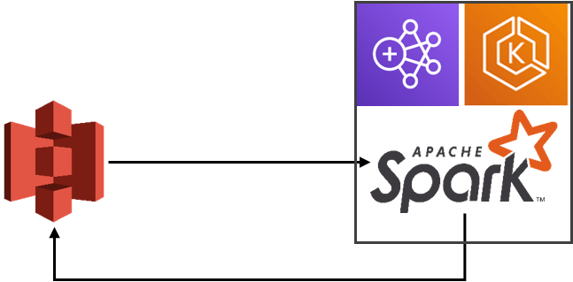

# spark-emr-eks
## About the project

This repository is an example of how to process and submit Spark job using AWS EMR on EKS.
The flow is simple, Spark will read data from S3, perform simple transformation and store back data into S3.





## Getting started

These are prerequisites that must be done before start the project:

1. Setup an AWS EC2 instance and configure an AWS account profile using AWS CLI
2. Install kubectl and eksctl

## Usage
1. Create directory <code> environment</code> and go there
2. Export several values into environment variables and create an S3 bucket
```shell
export ACCOUNT_ID=$(aws sts get-caller-identity --output text --query Account)
export AWS_REGION=us-east-1
export s3DemoBucket=s3://emr-eks-demo-${ACCOUNT_ID}-${AWS_REGION}
aws s3 mb $s3DemoBucket
```

3. Create EKS cluster
```shell
cat << EOF > eksworkshop.yaml
---
apiVersion: eksctl.io/v1alpha5
kind: ClusterConfig

metadata:
  name: tlc-analytics-eks
  region: ${AWS_REGION}
  version: "1.21"

availabilityZones: ["us-east-1a", "us-east-1b"]
EOF
```
```shell
eksctl create cluster -f eksworkshop.yaml
```
4. Create namespace spark and RBAC permission
```shell
kubectl create namespace development
eksctl create iamidentitymapping --cluster tlc-analytics-eks  --namespace development --service-name "emr-containers" 
```
5. Enable IAM Roles for Service Account (IRSA)
```shell
eksctl utils associate-iam-oidc-provider --cluster tlc-analytics-eks --approve 
```
6. Create an IAM role for job execution
```shell
cat <<EoF > ~/environment/emr-trust-policy.json
{
  "Version": "2012-10-17",
  "Statement": [
    {
      "Effect": "Allow",
      "Principal": {
        "Service": "elasticmapreduce.amazonaws.com"
      },
      "Action": "sts:AssumeRole"
    }
  ]
}
EoF
aws iam create-role --role-name EMRContainers-JobExecutionRole --assume-role-policy-document file://~/environment/emr-trust-policy.json

cat <<EoF > ~/environment/EMRContainers-JobExecutionRole.json
{
    "Version": "2012-10-17",
    "Statement": [
        {
            "Effect": "Allow",
            "Action": [
                "s3:PutObject",
                "s3:GetObject",
                "s3:ListBucket"
            ],
            "Resource": "*"
        },
        {
            "Effect": "Allow",
            "Action": [
                "logs:PutLogEvents",
                "logs:CreateLogStream",
                "logs:DescribeLogGroups",
                "logs:DescribeLogStreams"
            ],
            "Resource": [
                "arn:aws:logs:*:*:*"
            ]
        },
        {
            "Effect": "Allow",
            "Action": [
                *
            ],
            "Resource": [
                "arn:aws:logs:*:*:*"
            ]
        }
    ]
}  
EoF

aws iam put-role-policy --role-name EMRContainers-JobExecutionRole --policy-name EMR-Containers-Job-Execution --policy-document file://~/environment/EMRContainers-JobExecutionRole.json
aws emr-containers update-role-trust-policy --cluster-name tlc-analytics-eks --namespace spark --role-name EMRContainers-JobExecutionRole
```
7. Register EKS cluster with EMR
```shell
aws emr-containers create-virtual-cluster \
--name tlc-analytics-eks \
--container-provider '{
    "id": "tlc-analytics-eks",
    "type": "EKS",
    "info": {
        "eksInfo": {
            "namespace": "spark"
        }
    }
}'
```
8. Create EKS Managed Node Group with 3 instance of m5.xlarge class
```shell
cat << EOF > addnodegroup.yaml
---
apiVersion: eksctl.io/v1alpha5
kind: ClusterConfig

metadata:
  name: tlc-analytics-eks
  region: ${AWS_REGION}

managedNodeGroups:
- name: emrnodegroup
  desiredCapacity: 3
  instanceType: m5.xlarge
  ssh:
    enableSsm: true
EOF

eksctl create nodegroup --config-file=addnodegroup.yaml
```
9. Create environment variables as below
```shell
export VIRTUAL_CLUSTER_ID=$(aws emr-containers list-virtual-clusters --query "virtualClusters[?state=='RUNNING'].id" --output text)
export EMR_ROLE_ARN=$(aws iam get-role --role-name EMRContainers-JobExecutionRole --query Role.Arn --output text)
```
10. Create a cloudwatch log group before we can start sending the logs
```shell
aws logs create-log-group --log-group-name=/emr-on-eks/tlc-analytics-eks
```
11. Before running a Spark job, we need to upload our code to S3 bucket. I upload the code at:
```shell
${s3DemoBucket}/spark-emr-eks
```
12. Run a Spark job as below
```shell
cat > request.json <<EOF 
{
    "name": "pi-7",
    "virtualClusterId": "${VIRTUAL_CLUSTER_ID}",
    "executionRoleArn": "${EMR_ROLE_ARN}",
    "releaseLabel": "emr-6.2.0-latest",
    "jobDriver": {
        "sparkSubmitJobDriver": {
            "entryPoint": "${s3DemoBucket}/spark-emr-eks/python/agg_fhvhv_trip.py",
            "entryPointArguments":["2022-03", "${s3DemoBucket}"], 
            "sparkSubmitParameters": "--conf spark.executor.instances=2 --conf spark.executor.memory=2G --conf spark.executor.cores=2 --conf spark.driver.cores=1 --py-files ${s3DemoBucket}/spark-emr-eks/artifact/util.zip "
        }
    },
    "configurationOverrides": {
        "applicationConfiguration": [
            {
                "classification": "spark-defaults",
                "properties": {
                  "spark.dynamicAllocation.enabled": "false",
                  "spark.kubernetes.executor.deleteOnTermination": "true"
                }
            }
        ],
        "monitoringConfiguration": {
            "cloudWatchMonitoringConfiguration": {
                "logGroupName": "/emr-on-eks/tlc-analytics-eks",
                "logStreamNamePrefix": "nytaxi"
            },
            "s3MonitoringConfiguration": {
                "logUri": "${s3DemoBucket}/"
            }
        }
    }
}
EOF

aws emr-containers start-job-run --cli-input-json file://request.json
```
13. Wait it until finished. You can see the output data at
```shell
${s3DemoBucket}/spark-emr-eks/output/parquet/fhvhv_tripdata_summary/{month_partition}
```
14. To cleanup everything, execute command below
```shell
kubectl delete namespace development

for Job_id in $(aws emr-containers list-job-runs --states RUNNING --virtual-cluster-id ${VIRTUAL_CLUSTER_ID} --query "jobRuns[?state=='RUNNING'].id" --output text ); do aws emr-containers cancel-job-run --id ${Job_id} --virtual-cluster-id ${VIRTUAL_CLUSTER_ID}; done

aws emr-containers delete-virtual-cluster --id ${VIRTUAL_CLUSTER_ID}

eksctl delete nodegroup \
  --cluster tlc-analytics-eks \
  --region us-east-1 \
  --name emrnodegroup

eksctl delete cluster tlc-analytics-eks
```